# First Ever Project
This was the first ever Computer Science project that I made back in **Class XII (2016)**.

I thought I should upload it on github so that it does not get lost.

## Description

**Note** -  I am writing here the exact same description which I wrote in my project report back in 2016.

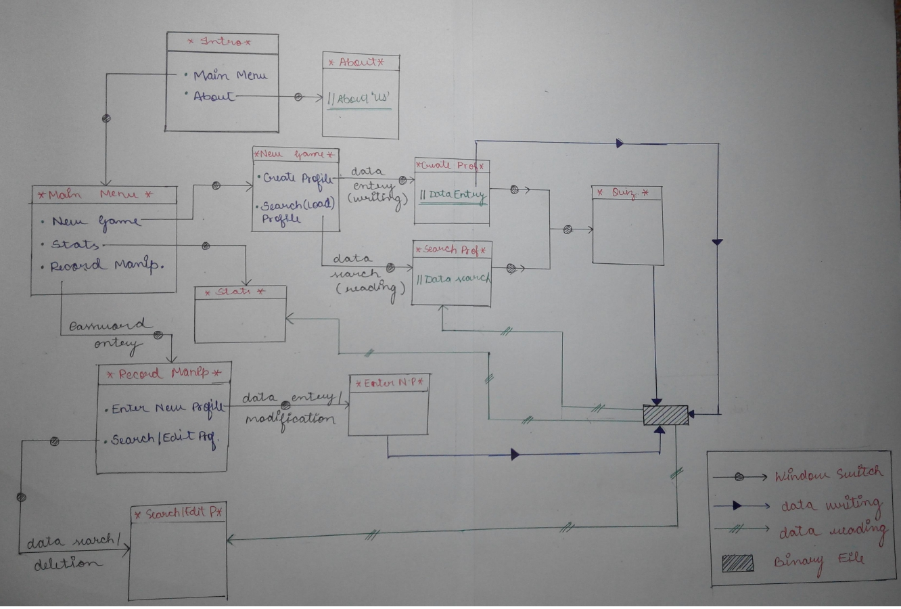

We have made a **‘Quiz Game’** on **C++** for our CS project. It has the following described Menus and their respective function (work) is also described.
1. **INTRODUCTION** - We can enter **‘Main menu’** OR **‘About’** from here.
2. **ABOUT** - This contains the name of the Group Members who have helped in successful completion of this project.
3. **MAIN MENU** - We can enter **‘New Game’** OR **‘Developer’s Section’** menus from here.
4. **NEW GAME** - We can enter **‘Create Profile’** OR **‘Load Profile’** menus from here.
5. **CREATE PROFILE** - If you are a new player, **‘Create’** your profile with a unique **‘Alias’** and proceed to the Game.
6. **LOAD PROFILE** - If your profile ALREADY EXISTS, then **‘Load’** it using your **‘Alias’** and proceed to the Game.
7. **QUIZ WINDOW** - Here you face the challenging questions of our Quiz. Are you ready to face them? ‘One’ point is awarded for Correct Answers and ‘None’ for Wrong Answers. You can Exit the Game at any point and we will display your Points.
8. **DEVELOPER'S SECTION** - You will have to pass through a **“firewall”** i.e. our **‘Password Entry Window’** to get in here as only the Developers are allowed in this Menu.
Once you are in, you can enter **‘Search/Edit Profile’** OR **‘Enter New Questions’** OR **‘View Profile’** menu from here.
9. **SEARCH/EDIT PROFILE** - You can enter **‘Edit Profile’** OR **‘Delete Profile’** menus from here.
10. **EDIT PROFILE** - You can **‘Edit’** your profile here i.e. you can change your **‘Name’** or **‘Age’** or even **‘Points’**( if you believe in cheat codes), but you must remember your **‘Alias’** for all this.
11. **DELETE PROFILE** - If you are fed up with your poor performance in our Quiz you can **‘Delete’** your profile from here with help of your **‘Alias’**.
12. **ENTER NEW QUESTIONS** - You can enter **‘New Questionnaire’** from here but remember old questions will vanish once you enter this menu.
13. **VIEW PROFILE** - Entering this Menu will take you to the **‘Profile Gallery’** which contains all the profiles (and their records), all at one place.

## Concepts Used
1. **File Handling in C++** - Binary Files are used to store Questions and User Data.
2. **Object Oriented Programming Concepts** - OOPs concepts are extensively used in this project.

## Output Screens

* Instructions

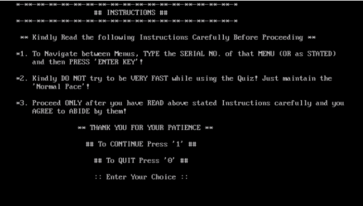

* Introduction

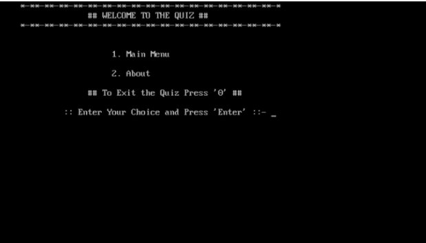

* About Us

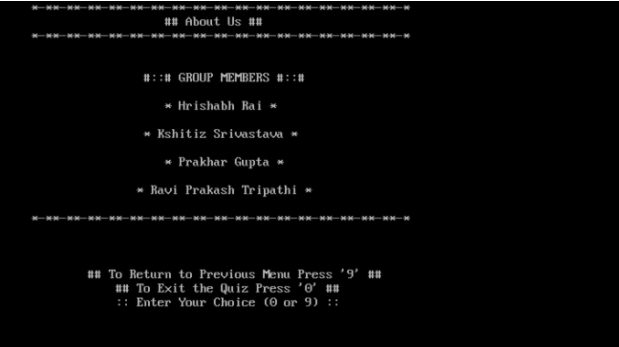

* Main Menu

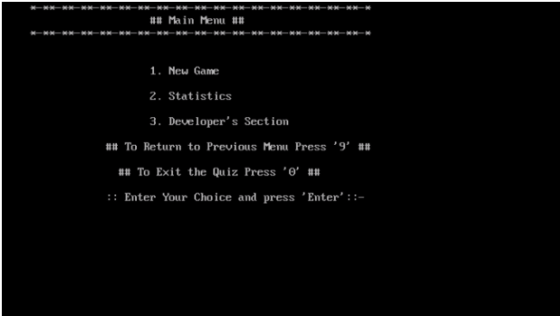

* New Game

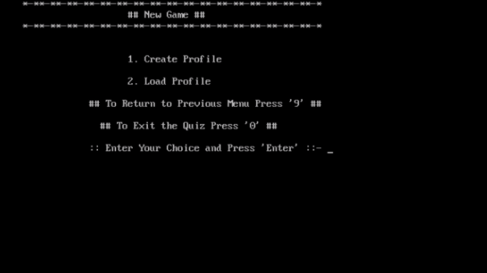

* Create Profile

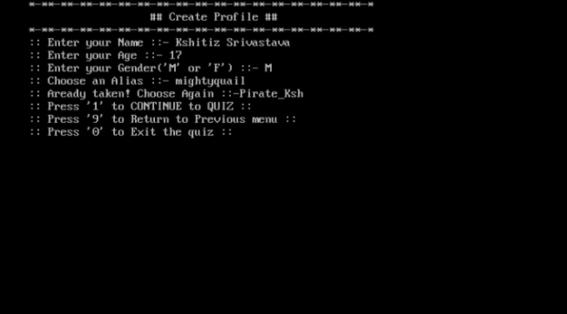

* Quiz Window

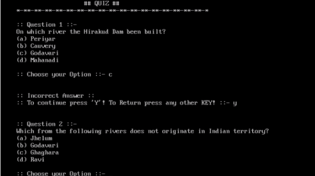

* Load Profile

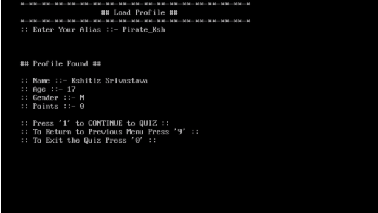

* Password Entry Window (Wrong Password)

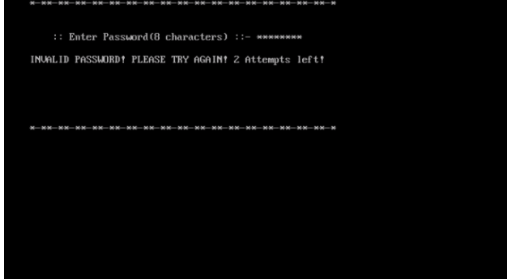

* Password Entry Window (Correct Password)

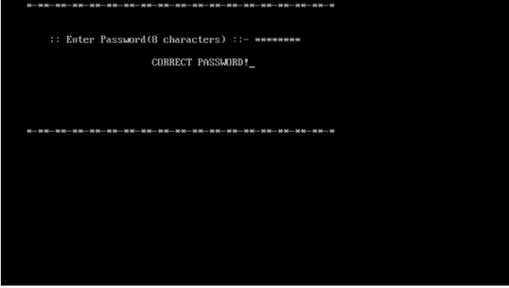

* Developer's Section

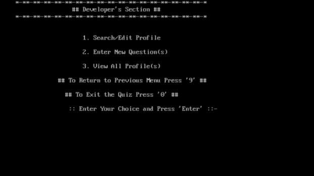

* Edit/Delete Profile

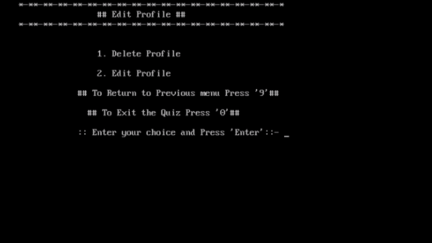

* Delete Profile

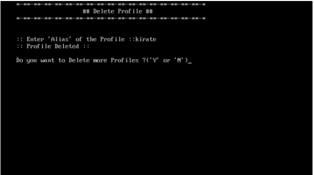

* Edit Profile

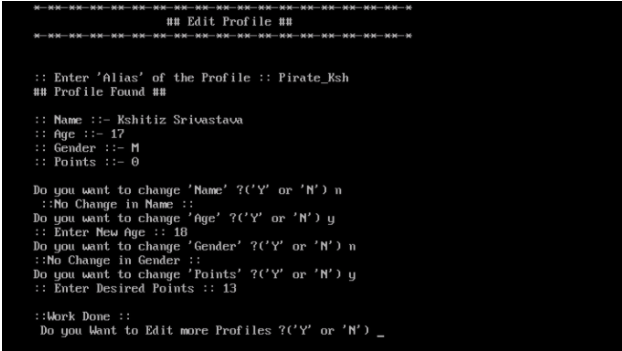

* Question Entry

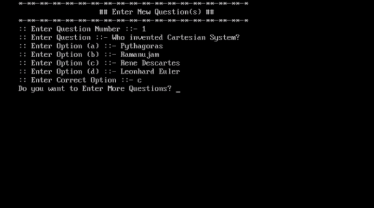

* Profile Gallary

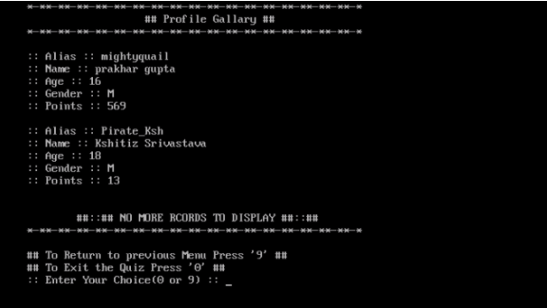

## How to Run
* Use **TurboC++** (Lol xD).

## Team Members
* [Kshitiz Srivastava](https://github.com/pirateksh)
* [Prakhar Gupta](https://github.com/prakhargupt00/)
* Hrishabh Rai (not on Github)
* Ravi Prakash Tripathi (not on Github)